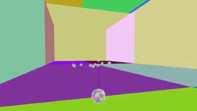
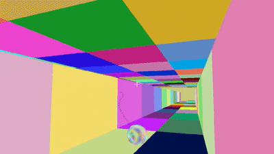
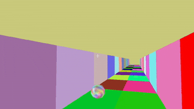

# RigidBody Physics Engine for Rope Action (From Scratch)

  접촉 지점에 따라 서로 다른 회전 반응이 발생

  

 

  SpringJoint를 이용한 로프 액션

  

 

  충돌 가능성이 있는 오브젝트만 선별(빨간색 하이라이트)

  

이 프로젝트는 상용 엔진이나 외부 물리 라이브러리를 사용하지 않고 RigidBody 물리 엔진을 처음부터 직접 구현한 개인 프로젝트입니다.

충돌 검출, Impulse 기반 충돌 해결(Solver), 회전, 마찰, 반발 처리 외에도 SpringJoint 기반의 로프 액션 물리 시스템까지 포함하고 있습니다.

## 프로젝트 목적

- 게임 엔진 내부에서 물리 시스템이 어떻게 동작하는지 이해
- 단순 충돌 처리가 아닌 충돌 지점에서 움직임이 만들어지는 물리 구현
- 로프 액션, 그래플링 훅 등 게임플레이에 직접 연결되는 물리 구조 설계

## 구현 내용

### RigidBody 시스템
- Dynamic / Static / Kinematic Body 분리
- 질량, 역질량(invMass) 기반 운동 처리
- 힘 누적(Force Accumulation) 방식 적용

### 충돌 검출 (Collision Detection)
- Broad Phase / Narrow Phase 구조 분리
- AABB 기반 1차 충돌 후보 필터링
- Narrow Phase : 기하 유형에 따른 충돌 구현

### 충돌 해결 (Impulse Solver)
- Impulse 기반 속도 변화 처리
- 접촉 지점 기준 회전(Angular Velocity) 발생
- 관성 텐서(Inertia Tensor) 및 역관성 텐서 적용
- 마찰(Friction) / 반발(Restitution) 처리
- Normal / Tangent Impulse 분리 계산

### SpringJoint (로프 액션 물리)
로프 액션 및 그래플링 훅 구현을 위해 RigidBody 간 거리 제약을 처리하는 SpringJoint 시스템을 구현했습니다.
- 앵커(Anchor)와 RigidBody 사이의 거리 기반 제약
- 스프링 상수(Spring Constant) 기반 복원력 계산
- 감쇠(Damper)를 이용한 진동 안정화

### 물리 시스템 구조
#### PhysicsWorld
- 전체 RigidBody 및 Collider 관리
- Joint(SpringJoint) 업데이트
#### UniformGrid
- Broad Phase 충돌 후보 생성
#### CollisionDetector
- Narrow Phase 충돌 판별
- 충돌 정보(Contact) 생성
#### Solver
- Normal/Tangent Impulse 계산
- Penetration 해결
#### SpringJoint
- 거리 제약 계산
- 스프링 / 감쇠 힘 계산
- RigidBody에 힘 적용하여 스윙 효과 만들기

### 기술 스택
- Language: C++
- Graphics: DirectX9 기반 커스텀 엔진

### 관련 링크

🎥 YouTube 데모 영상
https://www.youtube.com/watch?v=b6DHAo7Kmhk

✍️ Velog 기술 정리
https://velog.io/@jizzvibe/series/Rope-Simulation

### 참고자료
https://github.com/NathanMacLeod/physics3D/tree/master/Game 
충돌 시 임펄스를 처리하는 과정을 참고했습니다. 

https://github.com/siggraphcontact/rigidBodyTutorial
관성 텐서 및 회전 처리에 대한 전반적인 흐름을 참고했습니다.

https://github.com/godotengine/godot
물리 적용 순서를 참고했습니다. 

https://www.youtube.com/watch?v=8nENcDnxeVE&t=111s
로프의 흔들리는 효과를 참고했습니다.
